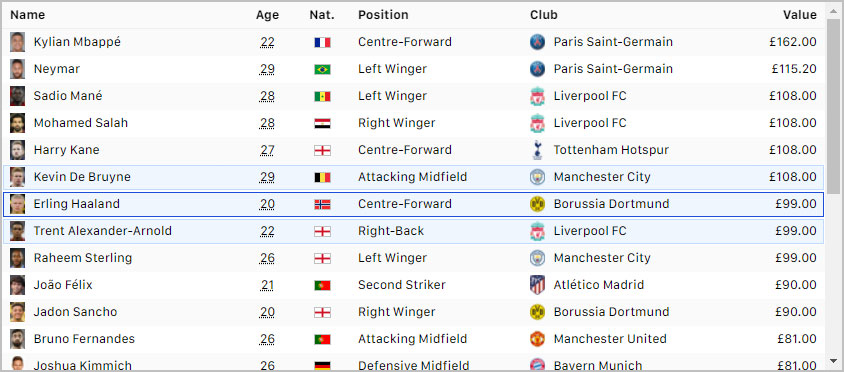

# react-classic-table

> Classic data viewer table for React

# Installation

```bash
yarn add react-classic-table
```

# Example

look to /examples folder

# Component Properties

| Property            | Type                          | Default     | Required  | Description                                                          |
| :------------------ | :---------------------------- | :---------- | :-------- | :------------------------------------------------------------------- |
| columns             | Array `<ColumnInfoObject>[]`  |             | `true`    | Columns to show in table                                             |
| rows                | Array `<object>[]`            |             | `true`    | Rows to list in table                                                |
| defaultSelectedRows | Array `<number>[]`            | `[]`        |           | Selected row indexes                                                 |
| onSelectRow         | Function                      | `undefined` |           | Function to call when rows are selected: `function (index, indexes)` |


## Column Info Object Properties

| Property    | Type     | Default     | Required  | Description                                                     |
| :---------- | :------- | :---------- | :-------- | :-------------------------------------------------------------- |
| key         | String   |             | `true`    | Unique column key                                               |
| title       | String   |             | `true`    | Column title                                                    |
| renderProp  | String   |             | `true`    | Property to be render in column                                 |
| alignment   | String   | `'start'`   |           | `['start', 'center', 'end']`                                    |
| render      | Function | `undefined` |           | Function to customize the column value: `function (value, row)` |

